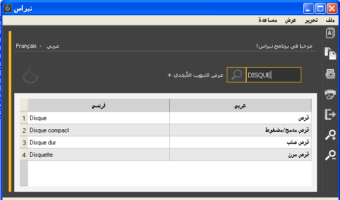
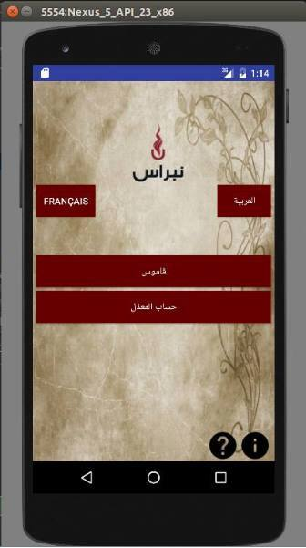
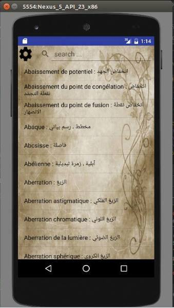
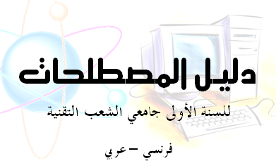

# Nibras Application
Nibras: a technical terms dictionary for Students

  Developpers: Oulmi Mehdi  mehdioulmi @ gmail.com Attig Bilal atgbilal @ gmail.com
  Director: 	Taha Zerrouki: http://tahadz.com 	taha dot zerrouki at gmail dot com

Features |   value
---------|---------------------------------------------------------------------------------
Authors  | [Authors.md](https://github.com/linuxscout/nibras-app/AUTHORS.md)
Release  | 0.2
License  |[GPL](https://github.com/linuxscout/nibras-app/LICENSE)
Tracker  |[linuxscout/nibras-app/Issues](https://github.com/linuxscout/nibras-app/issues)
Website  |[Nibras](http://nibras.sourceforge.net)
Source  |[Github](http://github.com/linuxscout/nibras-app)
Download  |[sourceforge](https://sourceforge.net/projects/nibras/files/nibras.0.2.apk/download)
Accounts  |[@Facebook](http://facebook.com/studentnibras) [@Sourceforge](http://sourceforge.net/projectsnibras-app/)

نبراس، هو دليل موجه إلى طلبة السنة الأولى للشعب التقنية بالجامعة، ويحتوي على أهم المصطلحات والمفردات إلى يصادفها في البرنامج الدراسي خلال هذه السنة المهمة. ويحوي هذا المعجم على أزيد من 2160 مصطلح، نحاول بها أن نغطي مجالات الشعب التقنية في السنة الأولى جامعي. 

الدليل يأتي في أشكال متنوعة أحدهما برنامج للبحث في المصطلحات، كما يسمح باقتراح مصطلحات جديدة.

,تطبيق اندرويد

وكتاب يمكن للطلبة طبعه والاستفادة منه

### مزايا التطبيق  

-   البرنامج مفتوح المصدر
-   البحث في الدليل بالعربية والفرنسية، وأجزاء من الكلمة
-   إمكانية إضافة مصطلح جديد

### التحميل  
- [تحميل
    التطبيق](https://sourceforge.net/projects/nibras/files/nibras.0.2.apk/download)

- [تحميل برنامج البحث](http://sourceforge.net/projects/nibras/files)
- تحميل الكتاب
  [**كاملا**](http://sourceforge.net/projects/nibras/files/Nibras-StudentGuideTech0.3.pdf/download)
    أو [**مختصرا
   للطباعة**](https://sourceforge.net/projects/nibras/files/Nibras-StudentGuideTech0.4-printable.pdf/download)
- [تحميل المصدر](https://github.com/01walid/Nibras)

### المساهمة

يرجى المساهمة في نشر هذا الموقع
و[الصفحة](https://web.facebook.com/studentnibras/) كي يصل الدليل إلى
أكبر عدد ممن يحتاج إليه، نطلب أيضا من الصحفيين أو المدونين الكتابة عنه،
للترويج له.

## Featured Posts

### مشاريع مشابهة 

-   [دليل المصطلحات للسنة الأولى في المدرسة الوطنية العليا للحاسوب
    بالجزائر](http://esidzstudentdic.sourceforge.net)
-   [دليل المصطلحات في المكتبية والتجهيزات والوسائل والتسيير المالي، من
المجلس الأعلى للغة العربية](http://hclalexique.sourceforge.net)
-   [**اكتشف المزيد عن مشاريعنا ....**](http://tahadz.com)

------------------------------------------------------------------------

### لإثراء الدليل 

Nibras GUI maintained by [01walid](https://github.com/01walid) and
[linuxscout](https://github.com/linuxscout).

